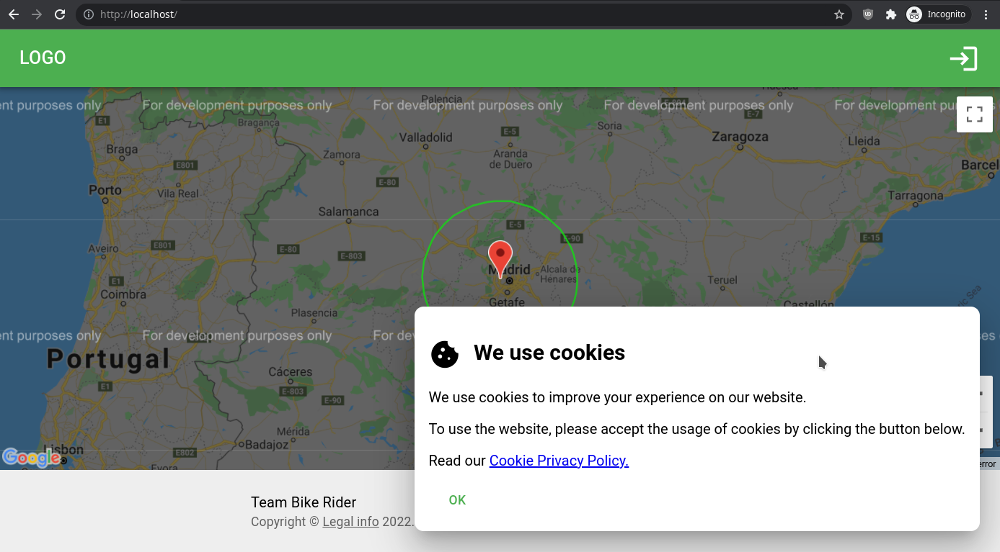
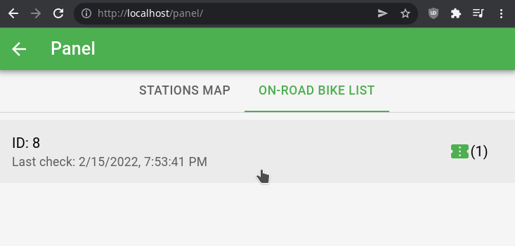
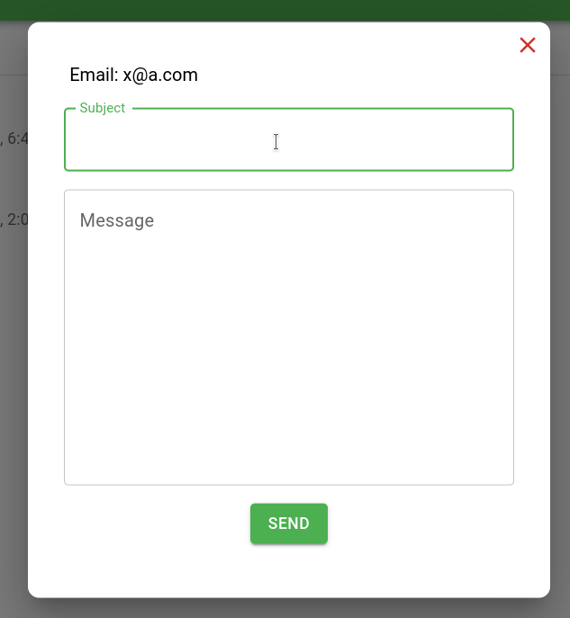

# Resumen y detalle técnico del diseño aplicado en Bike Rider

En este documento se detalla visualmente y técnicamente el diseño de todas las partes de la aplicación Bike Rider.

Se ha utilizado la libreria de UI para React llamada [MUI Material](https://mui.com).

El index.html contiene etiquetas meta: [index.html](frontend/index.html)

## Contenido

- [Resumen y detalle técnico del diseño aplicado en Bike Rider](#resumen-y-detalle-técnico-del-diseño-aplicado-en-bike-rider)
  - [Contenido](#contenido)
  - [Página de usuario](#página-de-usuario)
    - [Página principal](#página-principal)
  - [Página de Empleados](#página-de-empleados)
    - [Mantenimiento](#mantenimiento)
    - [Soporte](#soporte)
  - [Página de estación](#página-de-estación)

## Página de usuario

### Página principal

Esta es la página que los usuarios ven al entrar a la web. Se maqueta con flex y contiene etiquetas semánticas: [web.jsx](frontend/src/layout/web.jsx), [web.scss](frontend/src/layout/web.scss)

Se usan componentes para el header y footer: [header.jsx](frontend/src/components/web/header.jsx#L36), [footer.jsx](frontend/src/components/web/footer.jsx#L10)

Los componentes de MUI utilizados en el header y footer son:
`AppBar`,
`Container`,
`Toolbar`,
`Box`,
`IconButton`,
`Typography`,
`Icon`.

El contenido de la página principal es el mapa de Google. Se realizan las acciones a través de las ventanas de cada estacion en el mapa.

Para el pop up de uso de cookies se estiliza un componente `Box` de MUI y se añade el icono de la cookie con `Icon`: [legal.jsx](frontend/src/context/legal.jsx#L35)

Si no aceptamos la ventana de uso de cookies no nos deja registrarnos o iniciar sesión.

El toaster utiliza los componentes `Snackbar` y `Alert` de MUI: [toast.jsx](frontend/src/context/toast.jsx#L30)

El modal de login se maqueta con flex y con varios componentes de MUI: [loginForm.jsx](frontend/src/components/global/auth/loginForm.jsx#L39)

Los componentes de MUI utilizados son:
`Box`, `Typography`, `Grid`, `Link`, `TextField`, `Button`, `CircularProgress`.

El modal de registrar es similar pero utiliza el componente de `Checkbox` para el aceptamiento de la política de privacidad: [registerForm.jsx](frontend/src/components/global/auth/registerForm.jsx#L31)

Al hacer click en el enlace de la politica de privacidad se nos abre el modal con los términos.

El header de la aplicación es responsive. Al reducir el tamaño de la pantalla se oculta el menu en un desplegable: [menu.jsx](frontend/src/components/web/menu.jsx#L48)

Se usa el componente `Menu` y `MenuItem` para los desplegables.

Al hacer click en una estacion del mapa nos aparece una ventana de información maquetada con flex. a la derecha nos aparece una lista de todas las reservas activas para esa estación y un botón para realizar una reserva: [stationmap.jsx](frontend/src/components/global/stationmap.jsx#L115)

Se usa el componente `List` y `ListItem` para la lista de reservas.

El modal de reserva muestra tu reserva actual y un botón para cancelarla. [reservation.jsx](frontend/src/components/web/modals/reservation.jsx#L24)

El modal de subscripción muestra tu subscripción actual y un desplegable para cambiarla a otra. [subscription.jsx](frontend/src/components/web/modals/subscription.jsx#L35)

Se han utilizado los componentes `Select` y `MenuItem` para el desplegable.

El modal de reclamar un cupón. No hay mucho que decir: [coupon.jsx](frontend/src/components/web/modals/coupon.jsx#L16)

El formulario del modal de enviar un ticket cambia dependiendo de las opciones seleccionadas. La captura muestra un ejemplo para la creación de un ticket para reclamar una incidencia relacionada con la bici utilizada en el viaje indicado. [ticketForm.jsx](frontend/src/components/global/tickets/ticketForm.jsx#L85)

## Página de Empleados

En el panel tenemos diferentes pestañas que se muestran dependiendo de si eres un usuario de mantenimiento o de soporte. Las pestañas están hechas con los componentes MUI `Tabs`, `Tab` y `TabPanel`.

Se han utilizado atributos `aria` en las pestañas del panel y contenido: [tabpanel.jsx](frontend/src/components/panel/tabpanel.jsx#L6), [pages/panel.jsx](frontend/src/pages/panel.jsx#L28)

### Mantenimiento

En la pestaña de bicis en carretera, nos sale un listado de bicis que están actualmente en camino a algún sitio: [roadlist.jsx](frontend/src/components/panel/roadlist.jsx#L15), [bikelist.jsx](frontend/src/components/panel/modals/bikelist.jsx#L18)

Se usan los componentes `ListItem` y `ListItemButton` para la acción principal y secundaria de los elementos de la lista.

Se puede hacer click encima para ver sus detalles:

El modal de detalle de bici tiene unos detalles de la bici y un estado que se puede cambiar con un desplegable: [bikeview.jsx](frontend/src/components/panel/modals/bikeview.jsx#L8)

Al hacer click sobre la acción secundaria de ver tickets, se nos abre un modal con la lista de tickets relacionados con esa bici: [ticketlist.jsx](frontend/src/components/panel/modals/ticketlist.jsx#L8)

Y al hacer click sobre el ticket nos muestra sus detalles. Se pueden ver los detalles del usuario que lo ha reportado y de la bici en cuestión: [ticketview.jsx](frontend/src/components/panel/modals/ticketview.jsx#L23), [clientview.jsx](frontend/src/components/panel/modals/clientview.jsx#L6)

Para mostrar la imagen del cliente se usa el componente `Avatar`.

En la página de estaciones podemos ver las estaciones que tenemos asignadas como mantenedores, y sus detalles como bicis y tickets al pinchar sobre ellas en el mapa: [stationmap.jsx](frontend/src/components/global/stationmap.jsx#L138)

Los modales de listado de tickets y bicis utilizan los mismos componentes que en el apartado anterior.

### Soporte

Si somos un usuario de tipo soporte, vemos la pestaña de tickets de soporte, donde podemos ver sus detalles y responder a los tickets: [supportlist.jsx](frontend/src/components/panel/supportlist.jsx#L17)

En el modal de responder al ticket se utiliza el `TextField` con el atributo `multiline` para que el mensaje pueda contener varias lineas: [sendmessage.jsx](frontend/src/components/panel/modals/sendmessage.jsx#L17)

## Página de estación

La página de estación no es normalmente accesible por un usuario o admin. Esta sección de la página solo está en los totems de las estaciones de las calles para desanclar la bici que se necesite.

El cuadro de login se maqueta con el componente `Grid` de MUI, que nos permite especificar los tamaños de un estilo similar a bootstrap (xs, md, lg): [station.jsx](frontend/src/pages/station.jsx#L19)

También se usa el componente `Paper` para la tarjeta que contiene los elementos.

La pantalla de las bicis de la estacion se maqueta con flex. [mainScreen.jsx](frontend/src/components/station/mainScreen.jsx#L14)

El modal de ticket de la estación nos permite poner incidencias sobre alguna bici o sobre la propia estación. Usa el mismo componente que el modal de tickets anterior.
